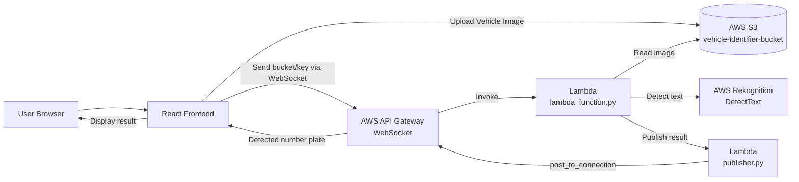

# Vehicle Number Plate Recognition System

A real-time vehicle number plate recognition system built with React and AWS services. The application allows users to upload vehicle images and automatically detects and extracts number plate information using AWS Rekognition OCR technology.

## 🚗 Project Overview

This project demonstrates a serverless architecture for automated vehicle number plate recognition. Users upload vehicle images through a web interface, which are processed in real-time using AWS cloud services. The system provides instant feedback with detected number plate information.

## ✨ Features

- **Real-time Image Upload**: Upload vehicle images with live progress tracking (0-100%)
- **Automatic Number Plate Detection**: Uses AWS Rekognition to extract text from vehicle number plates
- **WebSocket Communication**: Real-time bidirectional communication between frontend and backend
- **Live Connection Status**: Visual indicator showing WebSocket connection status
- **Responsive UI**: Clean and intuitive interface built with React
- **Secure Credential Management**: Environment-based AWS credential configuration
- **Cloud Storage**: Images stored securely in AWS S3

## 🏗️ Architecture

### Architecture Diagram



### Frontend
- **Framework**: React 19.2.4
- **Build Tool**: Create React App
- **AWS SDK**: @aws-sdk/client-s3, @aws-sdk/lib-storage (v3.995.0)
- **Icons**: react-icons (v5.5.0)

### Backend (AWS Services)
- **Storage**: AWS S3 (vehicle-identifier-bucket)
- **Compute**: AWS Lambda (Python)
- **OCR Engine**: AWS Rekognition
- **Real-time Communication**: AWS API Gateway WebSocket
- **Region**: us-east-1

### Workflow
1. User selects vehicle image from local device
2. Frontend uploads image to S3 bucket with progress tracking
3. Frontend sends image metadata to backend via WebSocket
4. Lambda function retrieves image from S3
5. AWS Rekognition analyzes image and detects text
6. Results are sent back to frontend via WebSocket
7. Number plate information is displayed to user

## 📋 Prerequisites

- Node.js (v14 or higher)
- npm or yarn package manager
- AWS Account with:
  - S3 bucket created
  - Lambda functions deployed
  - API Gateway WebSocket endpoint configured
  - IAM credentials with necessary permissions
- Git

## 🚀 Installation & Setup

### 1. Clone the Repository
```bash
git clone https://github.com/djrajasekar/vehicle-number-identifier.git
cd vehicle-number-identifier
```

### 2. Install Dependencies
```bash
npm install
```

### 3. Configure Environment Variables

Create a `.env.local` file in the project root with your AWS credentials:

```env
REACT_APP_BUCKETNAME=vehicle-identifier-bucket
REACT_APP_REGION=us-east-1
REACT_APP_WEBSOCKET_URL=wss://mwtqeze40m.execute-api.us-east-1.amazonaws.com/dev-vehicle/
REACT_APP_AWS_ACCESS_KEY_ID=your_access_key_id_here
REACT_APP_AWS_SECRET_ACCESS_KEY=your_secret_access_key_here
```

**Important**: 
- Never commit `.env.local` to version control
- Use `.env.local.example` as a template
- Restart the development server after changing environment variables

### 4. Backend Setup (AWS Lambda)

Deploy the Lambda functions located in the `server/` directory:
- `lambda_function.py`: Main handler for image processing
- `publisher.py`: WebSocket message publisher

Ensure Lambda has:
- S3 read permissions
- Rekognition DetectText permissions
- API Gateway Management permissions

## 💻 Usage

### Development Mode
```bash
npm start
```
Opens the application at [http://localhost:3000](http://localhost:3000)

### Build for Production
```bash
npm run build
```
Creates optimized production build in the `build/` folder

### Run Tests
```bash
npm test
```

## 🔌 WebSocket Connection Status

The application displays a connection indicator icon:
- **Grey**: Disconnected or initializing
- **Green**: Connected and ready
- **Red**: Connection error

## 📁 Project Structure

```
vehicle-number-identifier/
├── public/              # Static files
├── server/              # AWS Lambda backend functions
│   ├── lambda_function.py
│   └── publisher.py
├── src/
│   ├── App.js          # Main React component (fully commented)
│   ├── App.css         # Application styles
│   ├── index.js        # React entry point
│   └── SampleImages/   # Test images
├── .env.local.example  # Environment variable template
├── .gitignore
├── package.json
├── vercel.json         # Vercel deployment configuration
└── README.md
```

## 🚀 Deployment

### Vercel Deployment

1. Push your code to GitHub
2. Import project in Vercel dashboard
3. Configure environment variables in Vercel:
   - `REACT_APP_AWS_ACCESS_KEY_ID`
   - `REACT_APP_AWS_SECRET_ACCESS_KEY`
   - `REACT_APP_BUCKETNAME`
   - `REACT_APP_REGION`
   - `REACT_APP_WEBSOCKET_URL`
4. Deploy

Configuration is provided in `vercel.json`

## 🔒 Security Best Practices

- AWS credentials stored in environment variables (not in code)
- `.env.local` excluded from version control via `.gitignore`
- Use IAM roles with minimal required permissions
- Consider using AWS Cognito for production authentication
- Implement API rate limiting on backend

## 🛠️ Technologies Used

- **Frontend**: React, JavaScript (ES6+), CSS
- **AWS Services**: S3, Lambda, Rekognition, API Gateway WebSocket
- **Build Tools**: Create React App, npm
- **Version Control**: Git, GitHub
- **Deployment**: Vercel

## 📝 Code Documentation

The main application file (`src/App.js`) contains comprehensive inline comments explaining:
- Component state management
- WebSocket lifecycle and event handlers
- S3 upload process with progress tracking
- Backend communication flow
- UI rendering logic

Perfect for new developers joining the project!

## 🐛 Troubleshooting

### "WebSocket is not connected"
- Check if API Gateway WebSocket endpoint is active
- Verify `REACT_APP_WEBSOCKET_URL` is correct
- Ensure backend Lambda is deployed

### "Upload is failed"
- Verify AWS credentials are correct
- Check S3 bucket name matches configuration
- Ensure IAM user has S3 PutObject permissions

### "No response from server yet"
- Check Lambda function logs in CloudWatch
- Verify Lambda has Rekognition permissions
- Ensure publisher.py is correctly configured

### Environment variables not loading
- Restart development server after changing `.env.local`
- Ensure variables start with `REACT_APP_` prefix
- Check for typos in variable names

## 📜 License

This project is open source and available for educational purposes.

## 👤 Author

**DJ Rajasekar**
- GitHub: [@djrajasekar](https://github.com/djrajasekar)
- Repository: [vehicle-number-identifier](https://github.com/djrajasekar/vehicle-number-identifier)

## 🙏 Acknowledgments

- AWS Rekognition for OCR capabilities
- Create React App for project bootstrapping
- React Icons for UI components

---

Built with ❤️ using React and AWS
